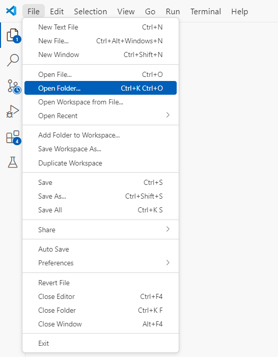
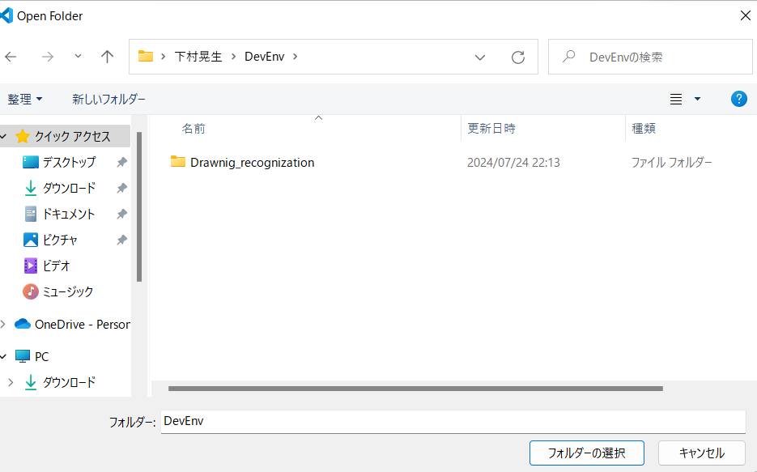
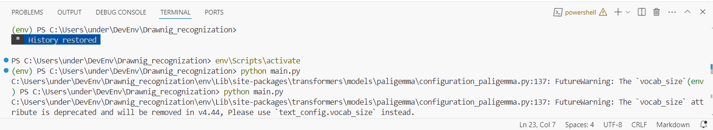
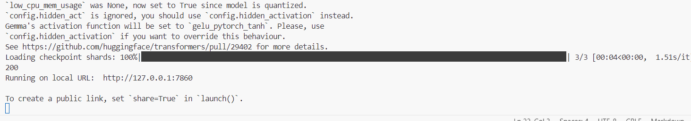
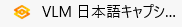
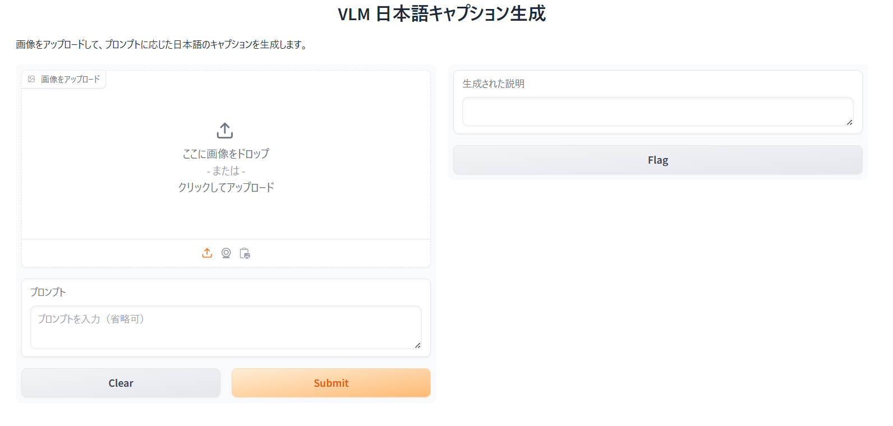

# お絵描き認識
## セットアップ
1. ライブラリのインストール
  terminalでpip install requirements.pyを実行
3. モデルのダウンロード
  model_donwnloader.pyを実行
4. ソフトの立ち上げ
  visual Stdusio Code とvoice voxを立ち上げる
5. visualstudiocodeでフォルダを開く 　
  左上のFileからDrawingRecognizationを開く
  

4.仮想環境を起動してファイルの実行
キーボードでctrl+@を押して、terminalを開き、仮想環境してファイルを実行
 
```
env\Scripts\activate
python main.py
```
下記の状態になったら、成功してます
 
5.サーバーが立ち上がるので、そこにアクセスする
次に、edgeを開いて、[http://127.0.0.1:7860/](http://127.0.0.1:7860/)にアクセス(お気に入りバーのところから開けます)
 

## 使い方
 
この画面になっていると思うので、画像をアップロードのところの 
このアイコンをクリックし、カメラを起動。プロンプトのところに質問を入力（しなくてもok)して、submitボタンをクリック
